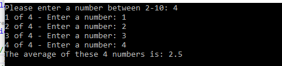

# Lab03-System IO

## Author: Alan Hung
## Contributors: Matthew Petersen, Mike, Jordan Kidwell, Kjell Overholt, Krystian Francuz-Harris

### Getting Started
* Open Visual Studio
* Clone [Lab 03 Git Repository](https://github.com/AlanYHung/Lab03_System_IO)
* Click Run

### Example
* 
* 
* 
* 
* 

### Change Log
* 0.1.0 - 1/13/2021 2:30pm - Lab Challenge 1
* 0.2.0 - 1/13/2021 3:15pm - Lab Challenge 2
* 0.3.0 - 1/13/2021 4:00pm - Lab Challenge 3
* 0.4.0 - 1/13/2021 4:45pm - Lab Challenge 4
* 0.5.0 - 1/13/2021 5:30pm - Lab Challenge 5
* 0.6.0 - 1/13/2021 6:15pm - Lab Challenge 6 & 7
* 0.7.0 - 1/14/2021 7:00pm - Lab Challenge 8
* 0.8.0 - 1/14/2021 8:00pm - Lab Challenge 9
* 0.9.0 - 1/14/2021 9:00pm - Setup Unit Tests
* 1.0.0 - 1/14/2021 11:00pm - Finished setting up all tests

### Attribution
* [Microsoft Docs](https://docs.microsoft.com/en-us/dotnet/csharp/language-reference/)
* [Stack Overflow](https://stackoverflow.com/questions/2695444/clearing-content-of-text-file-using-c-sharp)
* [blackwasp.co.uk](http://www.blackwasp.co.uk/CountTextFileLines.aspx)
